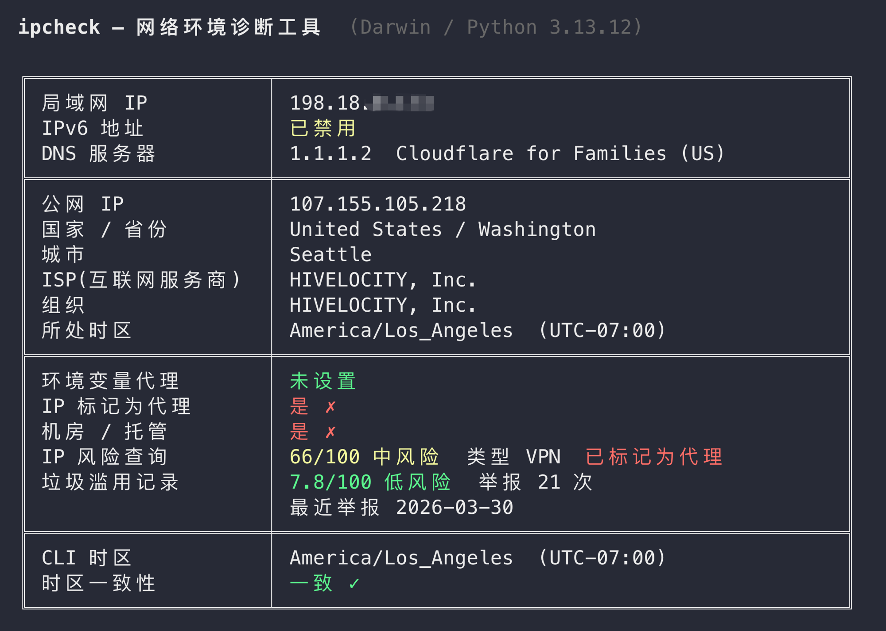

# ipcheck

A lightweight diagnostic tool for AI developers to verify network environment compatibility and IP reputation.

[中文](./README.md)



## Why

To ensure AI tools like Claude Code, OpenAI API, and Cursor run smoothly and reliably, a properly configured network environment is essential. Common issues that may affect performance:

- **IPv6 leaking real location** — Most proxies only handle IPv4; IPv6 can expose your actual geographic location
- **DNS leakage** — Local DNS servers can reveal your true location to AI services
- **High-risk IP** — Datacenter IPs or abused IPs may affect connection quality
- **Timezone mismatch** — Inconsistency between local timezone and IP geolocation

`ipcheck` detects all these issues in one run, ensuring your AI tools run smoothly and stably.

## Features

| Check Item | Description |
|------------|-------------|
| LAN IP / IPv6 | Detect local IP, verify if IPv6 is disabled |
| DNS Servers | Identify DNS origin (domestic/foreign), label known DNS providers |
| Public IP Info | Exit IP, country, region, ISP, organization |
| Proxy Detection | Env proxy settings, whether IP is flagged as proxy |
| IP Type | Residential vs. datacenter IP identification |
| IP Risk Score | Risk scoring via proxycheck.io |
| Abuse Records | IP abuse lookup via StopForumSpam |
| Timezone Consistency | Compare local CLI timezone with public IP geolocation timezone |

## Install

```bash
pip install ipcheck
```

## Usage

```bash
ipcheck
```

### Requirements

- Python 3.10+
- macOS / Linux / Windows

## Understanding the Results

**LAN & DNS** — Disable IPv6 if possible. Most proxies don't handle IPv6 traffic, which may expose two IPs from different regions simultaneously. If a domestic DNS is detected, adjust DNS settings in your proxy software.

**Public IP Info** — Shows your exit IP after proxy, including country/region, ISP, and timezone. These directly affect how AI services evaluate your request origin.

**IP Risk Assessment** — Identifies whether your IP is residential or datacenter. Datacenter IPs aren't necessarily problematic, but the tool will query risk scores and abuse records. Switch nodes if your risk score is high.

**Timezone Consistency** — Compares your local `$TZ` environment variable (or system timezone) with the public IP's timezone. Keeping them consistent ensures a better service experience. Set `TZ` in your shell config to match your IP's IANA timezone (e.g., `America/Los_Angeles`).

## License

[MIT](LICENSE) © 2026 stormzhang
